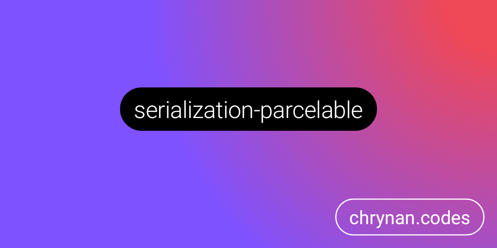
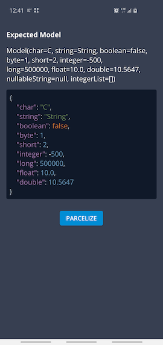

# parcelable

Android Parceling support for
the [Kotlinx Serialization library](https://github.com/Kotlin/kotlinx.serialization).
<br/>
<a href="https://androidweekly.net/issues/issue-450"></img></a>

```kotlin
// Add to Android Intent
intent.putExtra(name = "com.example.MyModel", value = myModel, serializer = MyModel.serializer())

// Retrieve from Android Intent
val result =
    intent.getParcelableExtra(name = "com.example.MyModel", deserializer = MyModel.serializer())

check(result == myModel) // True

// Compose
val result = rememberSavable(serializer = MyModel.serializer()) { MyModel(...) }
```

All serialization for an Android or Multi-platform project can be handled from a single library, no
need to create both
custom Android Parcelers and Serializers. Use
the [Kotlinx Serialization library](https://github.com/Kotlin/kotlinx.serialization), and it will
automatically work
with Android's `Parcel`, `Bundle`, and `Intent`.

## Project Status

This is an **active** project, however, updates may be slow and responses delayed. The core
functionality of the project is already implemented, but I do not have the time or resources to
constantly devote to the project. So, I will update and respond when I have time.

> [!Note]
> Please consider making a [contribution](https://www.buymeacoffee.com/chrynan) to support the
> development of this and my other open source projects. Thank you!

### Background

I originally created this project when I was stuck in a Covid-19 quarantine lockdown during my trip
to Thailand. I wanted a way to leverage kotlinx.serialization to handle the parcelable data for
Android so that I didn't have to create verbose duplicate serialization logic, or leverage another
Android specific library which complicated a multiplatform codebase. So I hacked up this project and
it worked! Since then, I have made the project multiplatform and added additional functionality,
including adding support for Compose Multiplatform.

The convenience of having to write serialization logic for models once, and then it just working
regardless of the format is huge! With this library, you no longer have to write Android-specific
parcelables, duplicate models, or rely on another annotation processor or compiler plugin. Simply
use your existing serializable models, and use the `Parcelable` format whenever working with Android
components (Intents, Bundles, Parcels, etc.).

Many organizations and individuals have utilized this project resulting in a peak of thousands of
downloads per month. Unfortunately, fewer have made contributions. While this project is open source
and free to use in accordance with its [license](LICENSE), it takes time and resources to devote to
a project like this: from ideation, creation, implementation, maintenance, bug fixing,
communication, and hosting. Unfortunately, the amount of time and resources I have to maintaining
this project continues to decline. I, like most people, have bills to pay and a life to live, so my
time spent on this project will continue to decline unless there is incentive to keep it going. If
you find this project useful and would like to keep it alive, please consider making
a [contribution](https://www.buymeacoffee.com/chrynan), thank you!

## Getting Started 🏁

The library is provided through [Repsy.io](https://repsy.io). Checkout
the [releases page](https://github.com/chRyNaN/parcelable/releases) to get the latest version. <br/>


### Repository

```kotlin
repositories {
    maven { url = uri("https://repo.repsy.io/mvn/chrynan/public") }
}
```

### Dependency

#### Core

```kotlin
implementation("com.chrynan.parcelable:parcelable-core:$VERSION")
```

#### Compose

```kotlin
implementation("com.chrynan.parcelable:parcelable-compose:$VERSION")
```

## Usage 👨‍💻

### Set up the `Parcelable` object

Similar to the `Json` object introduced by
the [Kotlinx Serialization library](https://github.com/Kotlin/kotlinx.serialization), this library
introduces a
`Parcelable` object. The extension functions default to using the `Parcelable.Default` value if
a `Parcelable` instance
is not provided, but if customization is required, an instance can be created as follows:

```kotlin
val parcelable = Parcelable {
    serializersModule = mySerializersModule
}
```

### Use [Kotlinx Serialization](https://github.com/Kotlin/kotlinx.serialization)

Utilize the [Kotlinx Serialization](https://github.com/Kotlin/kotlinx.serialization) to serialize
your model classes.
These classes can then be used with Android's `Bundle`, `Intent`, and `Parcel` objects.

```kotlin
@Serializable
data class MyModel(
    val intField: Int,
    val stringField: String,
    val nullableStringField: String? = null
)
```

### Encode and decode models

#### `Intents` and `Bundles`

```kotlin
// Put
intent.putExtra(key, myModel, parcelable)
bundle.putParcelable(key, myModel, parcelable)

// Get
val myModel = intent.getParcelableExtra(key, parcelable)
val myModel = bundle.getParcelable(key, parcelable)
```

#### `Parcels` and `Bundles`

```kotlin
// To
parcelable.encodeToParcel(parcel, myModel)
val bundle = parcelable.encodeToBundle(myModel)

// From
val myModel = parcelable.decodeFromParcel(parcel)
val myModel = parcelable.decodeFromBundle(bundle)
```

#### `Saver` with Jetpack Compose

```kotlin
val model = rememberSavable(parcelable = parcelable, serializer = MyModel.serializer) { myModel }
```

### Multiplatform

This library is a Kotlin Multi-platform library and supports Android, iOS, JVM, and JS Kotlin
targets. The `Parcelable`
and `Parcel` objects are available in the common source set and can be used to encode and decode
models. Then, in
platform specific code, the `Parcels` can be stored and retrieved between different components (ex:
Android Intents).

```kotlin
// Common Code
val parcel = parcelable.encodeToParcel(serializer = MyModel.serializer(), value = myModel)

// Android Code
Bundle().readFromParcel(parcel)
```

## Documentation 📃

More detailed documentation is available in the [docs](docs) folder. The entry point to the
documentation can be
found [here](docs/index.md).

## Sample

The `sample-android` module contains an Android App showcasing the use of this library and providing
a means to test
parceling different models.

Simply update the `ExpectedModel.model` value to be any Serializable class and run the application
to test if the
parceling worked.

### Sample Screenshots




## Security 🛡️

For security vulnerabilities, concerns, or issues, please responsibly disclose the information
either by opening a
public GitHub Issue or reaching out to the project owner.

## Contributing ✍️

Outside contributions are welcome for this project. Please follow
the [code of conduct](CODE_OF_CONDUCT.md)
and [coding conventions](CODING_CONVENTIONS.md) when contributing. If contributing code, please add
thorough documents.
and tests. Thank you!

## Sponsorship ❤️

Support this project by [becoming a sponsor](https://www.buymeacoffee.com/chrynan) of my work! And
make sure to give the
repository a ⭐

## License ⚖️

```
Copyright 2021 chRyNaN

Licensed under the Apache License, Version 2.0 (the "License");
you may not use this file except in compliance with the License.
You may obtain a copy of the License at

   http://www.apache.org/licenses/LICENSE-2.0

Unless required by applicable law or agreed to in writing, software
distributed under the License is distributed on an "AS IS" BASIS,
WITHOUT WARRANTIES OR CONDITIONS OF ANY KIND, either express or implied.
See the License for the specific language governing permissions and
limitations under the License.
```
